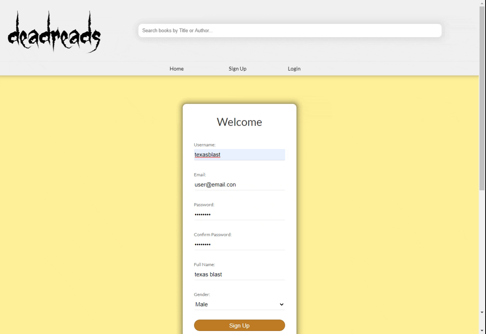

# [deadreads](https://deadreads.herokuapp.com/) - Social Media for Horror Book lovers
*By [Adam Jacobson](https://github.com/djangothesolarboy) [Zac Watts](https://github.com/zdwatts) [Michael Gann](https://github.com/michael-gann) [David Griffin](https://github.com/davidleegriffin)*

### [Table Of Contents]:
- [Description](https://github.com/djangothesolarboy/deadreads#Description)
- [Application Architecture && Technologies Used](https://github.com/djangothesolarboy/deadreads#Application-Architecture-&&-Technologies-Used)
- [Technology Shields](https://github.com/djangothesolarboy/deadreads#Technology-Shields)
- [Frontend Overview](https://github.com/djangothesolarboy/deadreads#Frontend-Overview)
- [Backend Overview](https://github.com/djangothesolarboy/deadreads#Backend-Overview)

## [Description]:
Deadreads, a goodreads clone, is a social media application that allows users to review horror books, add horror books to bookcrypts along with, view reviews and profiles of other horror book lovers.

Get [💀𝔰քօօӄʏ💀](https://deadreads.herokuapp.com/).

### [Application Architecture && Technologies Used]:
Deadreads was built using the Express NodeJS framework with a PostgreSQL(postgres) database to store all the application data in combination.

The frontend uses the [Pug](https://pugjs.org/api/getting-started.html) templating engine to render views from the frontend server. We used vanilla Javascript for interactivity and standard CSS for styling as well.

### [Frontend Overview]:
Most of the application was based on the backend and its database. Although there was a fairly heavy usage of the Pug template engine to create a more dynamic HTML page. The navigation should be easy and intuitive with the user having the ability to customize his/her/their experience.

### [Example Sign-up]
An example of the sign-up form

### [Example Login]:
An example of how to use the login function. If the user wishes to try the sites functionality before signing up, select the demo user button

### [Example of Site Navigation]
A display of various routes taken while navigating site

### [Backend Overview]:
Backend things.

## [Relational Database Model]:
One of the larger challenges of this project was ensuring we had the right database setup. We tried to design it well enough to cover all of the usages we needed. This project was incredibly important to have the relations between tables setup properly.

The end database schema:  

### [Conclusion && Next Steps]:
Things learned while we worked on deadreads:
- Some issues are immensely simple, but after long hours of programming you miss them.
- Pug is very particular about tags.
- More than one brain and one set of eyes is always better for debugging.
- Going back to the project with a fresh mind always helps.

### [Technology Shields]:
         